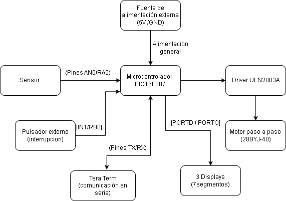
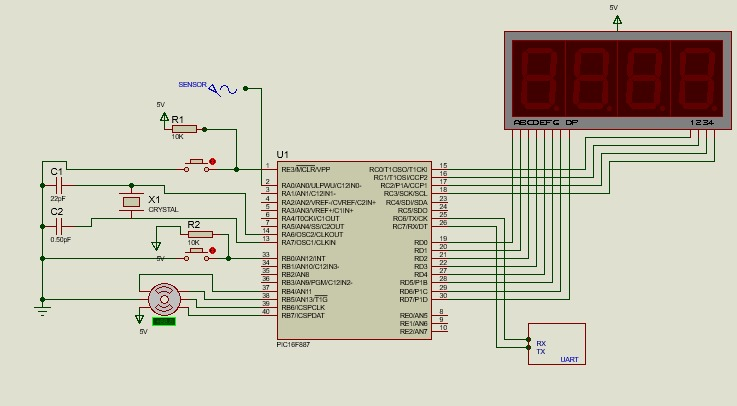
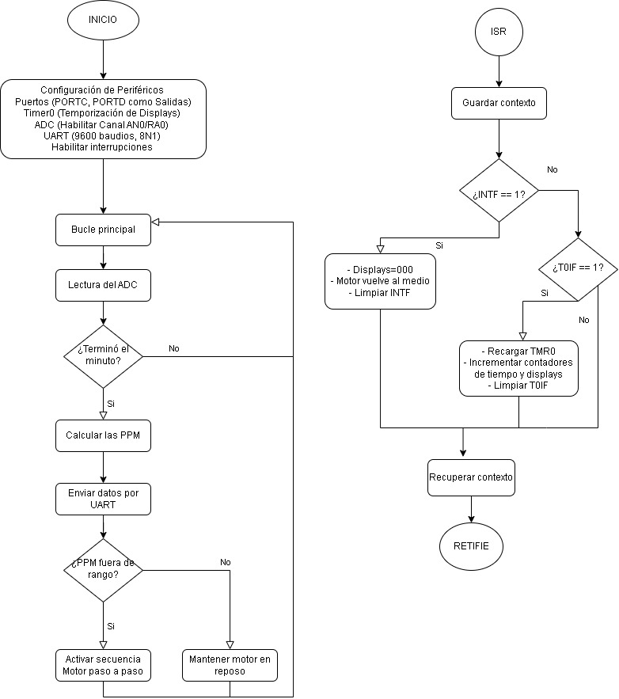

# Monitor de frecuencia cardiaca
>**Asignatura:** Electrónica Digital II  - Universidad Nacional de Córdoba
>
>**Profesor:** Marcos Blasco
>
>**Integrantes:**
> * Martina Bruno
> * Carolina Ottero 
> * Macarena Planas Montilla 
>   
---
## Descripcion general del proyecto
En este proyecto final de Electrónica Digital II, se desarrolló un monitor de frecuencia cardíaca que mide las pulsaciones del paciente en tiempo real y determina si se encuentra dentro de los valores normales. El sistema resuelve el riesgo de la demora en la atención médica de urgencia mediante un motor paso a paso que simula una bomba de infusión automatizada: si se detecta taquicardia, el motor gira a la izquierda para suministrar bisoprolol, y si se detecta bradicardia, gira a la derecha para administrar atropina.
Este dispositivo está dirigido al personal de salud y a unidades de cuidados intensivos que requieren un monitoreo constante y una reacción inmediata. Al automatizar la entrega de fármacos según la necesidad del paciente, funciona como un soporte vital crítico que minimiza los tiempos de respuesta ante crisis cardíacas.

### Alcances del Proyecto

**El sistema SÍ es capaz de:**
* Medir la frecuencia cardíaca en tiempo real mediante un sensor óptico, empleando filtrado por histéresis por software para evitar ruidos o falsas lecturas.
* Visualizar las pulsaciones por minuto (PPM) en tres displays de 7 segmentos multiplexados y transmitir los datos mediante comunicación serie (UART).
* Actuar automáticamente ante emergencias controlando un motor paso a paso que simula una bomba de infusión: medio giro a la izquierda ante taquicardia (dosificación de bisoprolol) o medio giro a la derecha ante bradicardia (dosificación de atropina).

**El sistema NO incluye (Fuera de alcance):**
* Almacenamiento local de datos históricos en tarjetas SD o memorias externas.
* Conectividad inalámbrica (Wi-Fi/Bluetooth) para enviar alertas a dispositivos móviles.

### Posibles Etapas Siguientes (Líneas Futuras)

* Migración a PCB: Trasladar el diseño actual desde la protoboard hacia un circuito impreso (PCB) optimizado y diseñado bajo normas de compatibilidad electromagnética para entornos médicos.
* Telemetría Inalámbrica: Implementar un módulo de comunicación para enviar alertas críticas directamente a un panel de monitoreo central en la estación de enfermería.

---

## Arquitectura del Sistema
### Hardware & Interconexión

* **Diagrama de Bloques:**
 

* **Esquemático del Circuito:**
   

* **Descripción del Circuito y Consideraciones de Diseño:**
  * *Etapa de Adquisición*: Módulo sensor óptico que capta las variaciones del flujo sanguíneo y entrega una señal analógica al ADC del microcontrolador.
  * *Etapa de Comunicación*: Módulo conversor USB-TTL (UART) para la conexión bidireccional con la PC. Permite ingresar valores numéricos de frecuencia cardíaca vía Tera Term para comandar el sistema.
  * *Etapa de Procesamiento y Control*: Microcontrolador PIC16F887. Procesa los datos del sensor y de la PC, clasificando el estado en normal, bradicardia o taquicardia.
  * *Etapa de Visualización*: Tres displays de 7 segmentos que muestran el valor de las PPM en tiempo real.
  * *Etapa de Potencia y Actuación*: Driver ULN2003 y motor paso a paso que realiza medio giro para alguno de los costados o se quede donde está, dependiendo de las pulsaciones medidas.

### Software
* **Diagrama de flujo:**
  

---

## Especificaciones Eléctricas, Alimentación y Entorno
### Parámetros de alimentación y consumo 

* **Tensión de operación del sistema:** Fuente externa regulada de 5V DC.

### Consideraciones de Software

* **Herramientas de Software:** MPLAB X IDE [v5.35] y compilador MPASM [v5.87]
* **Herramientas de programación:** PICkit 3, bootloader, Tera term
* **Configuración de Bits**:
  * Oscilador: Cristal externo de 4MHz
  * Watchdog Timer (WDT): OFF
  * Master Clear (MCLRE): ON
* **Periféricos Internos Utilizados:** Timer0, ADC, UART
* **Gestión de Interrupciones:** Primero se evalúa la bandera INTF (interrupción externa de RB0) y luego la bandera T0IF (Timer0). Se prioriza INTF porque corresponde a una acción del usuario (pulsador), por lo que se desea atenderla antes que las interrupciones periódicas del temporizador.
  
---

## Proceso de Integración y Desarrollo
 
---

## Ensayos, Pruebas y Resultados 

