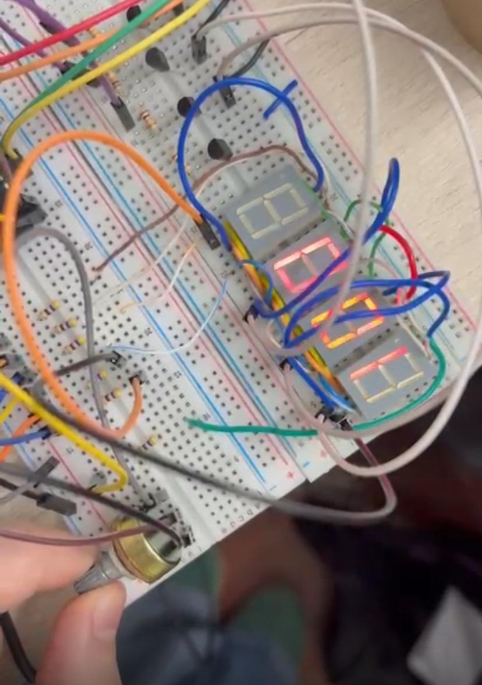
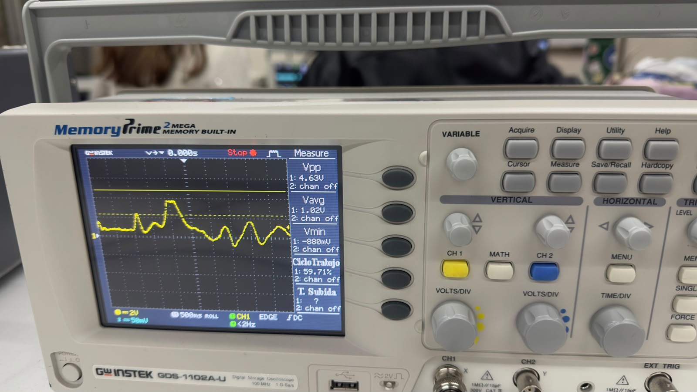
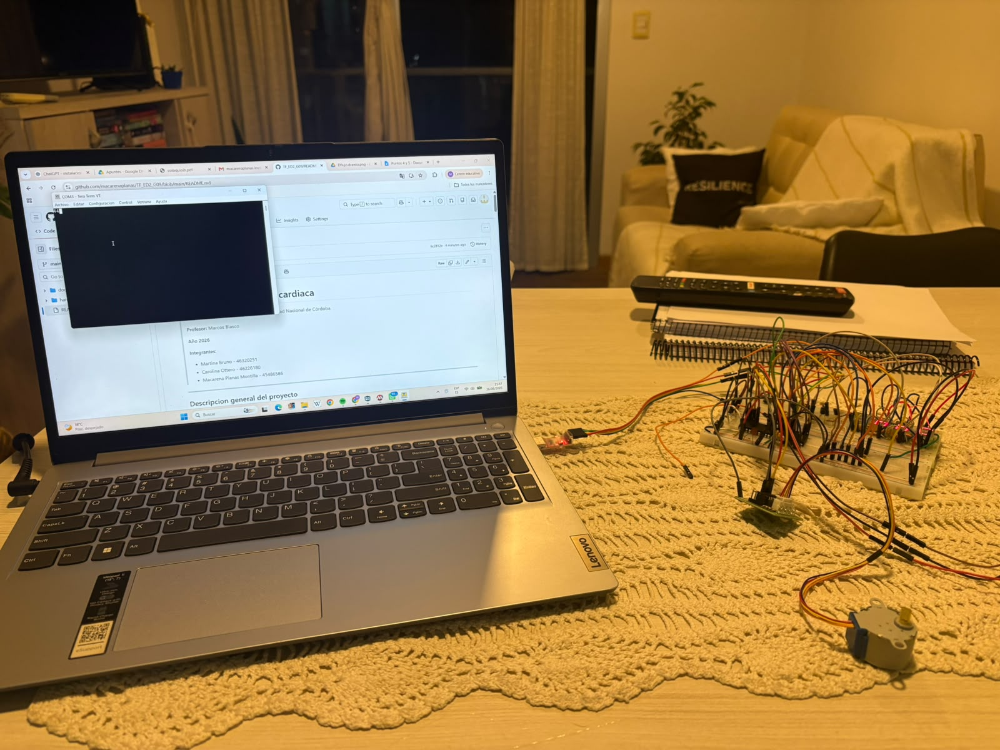
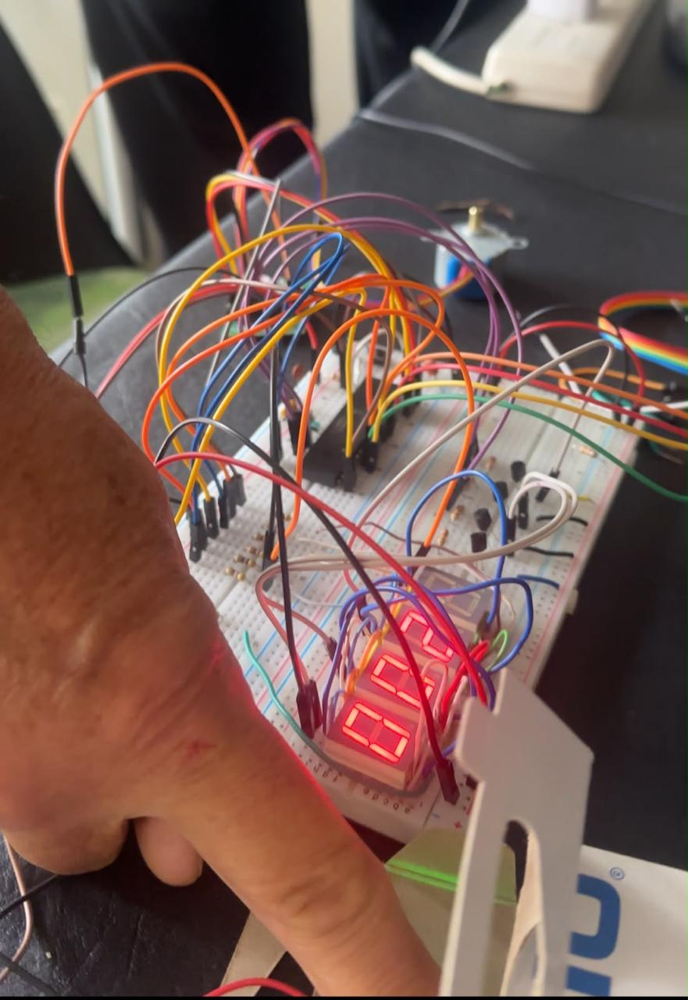

# Monitor de frecuencia cardiaca
>**Asignatura:** Electrónica Digital II  - Universidad Nacional de Córdoba
>
>**Profesor:** Marcos Blasco
>
>**Año:** 2026
>
>**Integrantes:**
> * Martina Bruno 
> * Carolina Ottero
> * Macarena Planas Montilla 
>   
---
## Descripcion general del proyecto
En este proyecto final de Electrónica Digital II, se desarrolló un monitor de frecuencia cardíaca que mide las pulsaciones del paciente en tiempo real y determina si se encuentra dentro de los valores normales. El sistema resuelve el riesgo de la demora en la atención médica de urgencia mediante un motor paso a paso que simula una bomba de infusión automatizada: si se detecta taquicardia, el motor gira a la izquierda para suministrar bisoprolol, y si se detecta bradicardia, gira a la derecha para administrar atropina.
Este dispositivo está dirigido al personal de salud y a unidades de cuidados intensivos que requieren un monitoreo constante y una reacción inmediata. Al automatizar la entrega de fármacos según la necesidad del paciente, funciona como un soporte vital crítico que minimiza los tiempos de respuesta ante crisis cardíacas.

### Alcances del Proyecto

**El sistema SÍ es capaz de:**
* Medir la frecuencia cardíaca en tiempo real mediante un sensor óptico, empleando filtrado por histéresis por software para evitar ruidos o falsas lecturas.
* Visualizar las pulsaciones por minuto (PPM) en tres displays de 7 segmentos multiplexados y transmitir los datos mediante comunicación serie (UART).
* Actuar automáticamente ante emergencias controlando un motor paso a paso que simula una bomba de infusión: medio giro a la izquierda ante taquicardia (dosificación de bisoprolol) o medio giro a la derecha ante bradicardia (dosificación de atropina).

**El sistema NO incluye (Fuera de alcance):**
* Almacenamiento local de datos históricos en tarjetas SD o memorias externas.
* Conectividad inalámbrica (Wi-Fi/Bluetooth) para enviar alertas a dispositivos móviles.

### Posibles Etapas Siguientes (Líneas Futuras)

* Migración a PCB: Trasladar el diseño actual desde la protoboard hacia un circuito impreso (PCB) optimizado y diseñado bajo normas de compatibilidad electromagnética para entornos médicos.
* Telemetría Inalámbrica: Implementar un módulo de comunicación para enviar alertas críticas directamente a un panel de monitoreo central en la estación de enfermería.

---

## Arquitectura del Sistema
### Hardware & Interconexión

* **Diagrama de Bloques:**
  

  

* **Esquemático del Circuito:**
* Utilizando software Proteus 8

  

* **Descripción del Circuito y Consideraciones de Diseño:**
  * *Etapa de Adquisición*: Módulo sensor óptico que capta las variaciones del flujo sanguíneo y entrega una señal analógica al ADC del microcontrolador.
  * *Etapa de Comunicación*: Módulo conversor USB-TTL (UART) para la conexión bidireccional con la PC. Permite ingresar valores numéricos de frecuencia cardíaca vía Tera Term para comandar el sistema.
  * *Etapa de Procesamiento y Control*: Microcontrolador PIC16F887. Procesa los datos del sensor y de la PC, clasificando el estado en normal, bradicardia o taquicardia.
  * *Etapa de Visualización*: Tres displays ánodo común de 7 segmentos que muestran el valor de las PPM en tiempo real.
  * *Etapa de Potencia y Actuación*: Driver ULN2003 y motor paso a paso que realiza medio giro para alguno de los costados o se quede donde está, dependiendo de las pulsaciones medidas.

### Software
* **Diagrama de flujo:**

  

---

## Especificaciones Eléctricas, Alimentación y Entorno
### Parámetros de alimentación y consumo 

* **Tensión de operación del sistema:** Fuente externa regulada de 5V DC.

### Consideraciones de Software

* **Herramientas de Software:** MPLAB X IDE [v5.35] y compilador MPASM [v5.87]
* **Herramientas de programación:** PICkit 3, bootloader, Tera term 5 
* **Configuración de Bits**:
  * Oscilador: Cristal externo de 4MHz 
  * Watchdog Timer (WDT): OFF
  * Master Clear (MCLRE): ON
* **Periféricos Internos Utilizados:** Timer0, ADC, UART
* **Gestión de Interrupciones:** Primero se evalúa la bandera INTF (interrupción externa de RB0) y luego la bandera T0IF (Timer0). Se prioriza INTF porque corresponde a una acción del usuario (pulsador), por lo que se desea atenderla antes que las interrupciones periódicas del temporizador.
  
---

## Proceso de Integración y Desarrollo

* **Etapa 1: Configuración del ADC y Displays (Potenciómetro)**: Prueba inicial del módulo ADC y del multiplexado de los displays de 7 segmentos utilizando un potenciómetro como entrada analógica variable en RA0.

* **Etapa 2: Medicion de señal del sensor**: Utilizando un osciloscopio, se intentó observar la señal proveniente del sensor.
  
* **Etapa 3: Validación del Sensor Óptico**: Verificación del correcto funcionamiento del sensor y el comportamiento de su señal analógica de salida.

* **Etapa 4: Control Independiente del Motor**: Desarrollo y validación de las rutinas de paso (secuencias en las tablas)  para asegurar el giro correcto del motor paso a paso.

* **Etapa 5: Integración de ADC y Comunicación UART**: Ensayo conjunto del conversor analógico-digital con el módulo de comunicación serie para verificar el envío de lecturas y la recepción de comandos desde Tera Term.

* **Etapa 6: Vinculación de todos los módulos**: lectura del sensor, procesamiento de las PPM, clasificación del estado del paciente y activación del motor como actuador final.
 
---

## Ensayos, Pruebas y Resultados 

* **Ensayo 1: Validación del ADC (Con Potenciómetro):**  Se utilizó un potenciómetro, donde luego se colocó el sensor, con visualización en los displays de 7 segmentos, para comprobar la correcta programación del mismo. 

  

* **Ensayo 2: Observacion de la señal del sensor:** Se intentó medir la salida analógica del sensor en los canales del osciloscopio, resultando inviable debido a la bajísima amplitud de la componente alterna, sumado a los artefactos de movimiento y ruido óptico de 50 Hz que saturaban la pantalla al no contar con un filtrado analógico acoplado en AC. 

  

* **Ensayo 3: Adquisición de la Señal del Sensor Óptico y Cálculo de PPM:** Con el sensor colocado en el dedo del usuario, se capturó la señal analógica. Se configuró un umbral por software para detectar los picos de la onda y calcular los intervalos entre latidos.

* **Etapa 4: Control Independiente del Motor**: Utilizando un botón como interrupción externa, se comprobó el correcto funcionamiento del motor paso a paso; en el que al presionarlo, el motor hacia medio giro.

* **Ensayo 5: Integración de ADC y Comunicación UART:** Se conectó el microcontrolador a la PC mediante el módulo UART. Se comprobó la transmisión periódica de datos, en el que cada vez que se procesaba un ciclo de lecturas, el sistema enviaba de forma clara el valor de PPM y el estado de alerta del paciente. Asimismo, se testeó la recepción de comandos desde Tera Term hacia el sistema sin pérdida de caracteres. 

  

* **Ensayo 6: Lógica de Control y Actuación del Motor Paso a Paso:** Se forzaron diferentes rangos de PPM simulados para evaluar la lógica de toma de decisiones del sistema y la respuesta del motor: 
     * *Estado Normal:* El motor no se mueve. 
     * *Estado Crítico (Taquicardia/Bradicardia):* Al cruzar los umbrales configurados, el motor gira hacia la posición de alerta de manera inmediata y fluida. 

  

 
